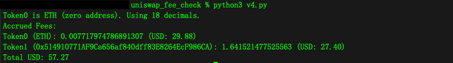

# Check Uniswap LP unclaimed fee (V3/V4)

## Usage:
`1. Set the TOKEN_ID to be the LP NFT number` \
`2. run python3 v3.py for v3` \
`3. run python3 v4.py for v4` 
`4. Or open html file in browser`

